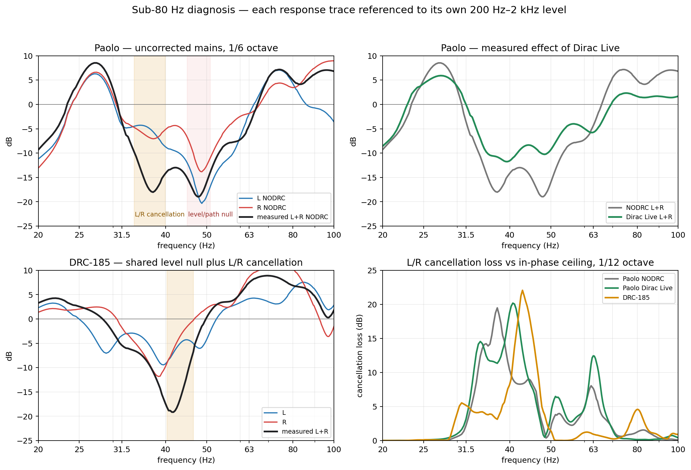

# Common bass correction survey: Paolo and DRC-185

## Executive result

The common sub-80 Hz correction described in
[`REW-INVERSION.md`](../DRC-doc/REW-INVERSION.md) is appropriate in both
rooms, but its benefit must be stated precisely:

> A common cut-only filter prevents room correction from making an L/R
> cancellation deeper. It cannot boost an existing acoustic null or change
> the cancellation itself.

If the same filter `C` is applied to both channels,

```text
C·L + C·R = C·(L + R)
```

so the L/R magnitude ratio and phase difference are unchanged. The common
filter can “recover” dB only relative to a bad per-channel correction that had
previously thrown those dB away. It cannot raise the uncorrected sum when
`Max gain = 0 dB`.

The important new result is that the two rooms have different anatomy:

- **Paolo NODRC:** two adjacent faults. A strong L/R cancellation spans about
  **33.7–39.9 Hz**, while the still deeper **47–50 Hz** hole is mainly a
  level/path failure already present in both individual channels. Dirac Live
  substantially lifts the measured broad depression but moves and broadens
  the L/R cancellation instead of eliminating it.
- **DRC-185:** the 40–46 Hz hole stacks shared placement/mode-node loss and
  L/R cancellation in the same band. Its known 1.85 m placement predicts the
  frequency exactly.



The figure uses 1/6-octave magnitude for readability. Cancellation regions
and maximum losses below use the native 0.3662 Hz complex data.

## Direct answer: useful, but timing sets a hard ceiling

The technique is **not useless in Paolo's room**. It is useful for two jobs:

1. applying the same sub-80 Hz cuts to both channels, so correction cannot
   deepen the L/R phase cancellation; and
2. reducing broad bass excess outside the nulls.

It is not capable of the job one would most like it to do: restore the missing
output in either large dip.

| sub-80 Hz task | common cut-only inversion |
|---|---|
| prevent independent filters changing L/R balance | **yes, exactly** |
| reduce peaks around 25–30 and 70–80 Hz | **yes** |
| preserve the uncorrected 34–40 Hz sum | **yes** |
| correct the 34–40 Hz L/R timing difference | **no** |
| fill the 47–50 Hz individual-channel/path null | **no** |
| add output where the target asks for boost | **no; the 0 dB clamp returns unity** |

A deliberately simple upper-bound diagnostic makes the balance clear. Take a
flat target at the measured midrange level and apply only the ideal common
cuts to the 1/6-octave NODRC sum over 20–80 Hz:

| metric, 20–80 Hz | uncorrected | after ideal common cuts |
|---|---:|---:|
| deepest point | **−19.0 dB** | **−19.0 dB** |
| highest point | +8.5 | 0.0 |
| peak-to-peak | 27.5 | **19.0** |
| RMS error against flat | 10.09 | **9.46** |

The filter can remove about 8.5 dB of excess and materially reduce
peak-to-peak variation, but RMS error improves only modestly because the two
uncorrectable depressions dominate. A real house target will not be flat and
will probably request less deep-bass cut, so these are diagnostic bounds, not
a proposed filter prediction.

The correct verdict is therefore **helpful but insufficient**. Timing does
dominate the 34–40 Hz outcome, and the 47–50 Hz path null dominates the worst
magnitude, but the common construction still prevents avoidable damage and
performs useful peak correction. The ordinary per-channel part above 80 Hz is
not invalidated by either bass fault.

## Data used and excluded

### Paolo

The uncorrected, mains-only baseline is:

- [`L NODRC nov 20.txt`](../Paolo/L%20NODRC%20nov%2020.txt)
- [`R NODRC nov 20.txt`](../Paolo/R%20NODRC%20nov%2020.txt)
- [`L+R NODRC nov 20.txt`](../Paolo/L+R%20NODRC%20nov%2020.txt)

The earlier `L nov 20`, `R nov 20`, `L+R nov 20` triplet is the same mains
measured with **Dirac Live active**. It is used only for the measured
before/after comparison. The `-copy` measurements are derived copies and are
not independent evidence. No measurement whose name contains `SUB` enters
this survey.

Both mains-only triplets use an acoustic timing reference played from the same
left speaker. The complex sum calculated from NODRC L and R reproduces the
physical NODRC L+R sweep with **0.23 dB median absolute error over 20–300 Hz**.
For the Dirac triplet the error is **0.19 dB**. The phase-cancellation analysis
is therefore valid.

### DRC-185

The reference set is [`L0.txt`](../DRC-185/L0.txt),
[`R0.txt`](../DRC-185/R0.txt), and [`LR.txt`](../DRC-185/LR.txt). Its calculated
and physical sums agree within **0.16 dB median absolute error** over
20–300 Hz.

## 1. Paolo, uncorrected mains

### What the sum contains

| observation | result |
|---|---:|
| main low-coherence region | **33.7–39.9 Hz** |
| maximum L/R cancellation | **21.6 dB at 37.4 Hz** |
| coherence there, `|L+R|/(|L|+|R|)` | **8%** |
| L/R magnitude mismatch there | **1.0 dB** |
| physical L+R native minimum, 20–80 Hz | **47.2 Hz, −31.7 dB re midrange** |
| physical L+R 1/6-octave minimum | **47.6 Hz, −19.0 dB re midrange** |

Those last two rows do **not** identify the cancellation frequency. The worst
physical dip is near 47–50 Hz, whereas the worst L/R opposition is around
37 Hz.

At 37.4 Hz, 1/6-octave L and R are about **−5.6 and −7.1 dB** relative to
their own midranges, and their opposition makes the measured sum about
**−18.0 dB**. This is a stacked but phase-dominated failure: moderate
individual losses followed by severe mutual cancellation.

At 47.5 Hz, L and R are already about **−18.4 and −12.8 dB** relative to
their own midranges. Their native phase difference is only about 15 degrees
there, so they are largely cooperating. The deep sum is a level/path null,
not an L/R cancellation. A common filter and an all-pass cannot manufacture
the missing acoustic output.

### What Dirac Live actually changed

Measured L+R, each condition referenced to its own 200 Hz–2 kHz level and
displayed at 1/6 octave:

| frequency | NODRC | Dirac Live | change |
|---|---:|---:|---:|
| 37.4 Hz | −18.0 | −10.8 | **+7.2 dB** |
| 40 Hz | −14.2 | −11.6 | +2.6 |
| 47.6 Hz | −19.0 | −10.1 | **+8.9** |
| 50 Hz | −15.6 | −9.1 | +6.5 |
| 63 Hz | −4.4 | −5.7 | −1.4 |
| 71 Hz | +6.3 | +1.3 | −5.0 |
| 80 Hz | +5.1 | +1.7 | −3.4 |

Dirac therefore produced a materially flatter bass response: the 1/6-octave
worst point improved from **−19.0 to −11.8 dB**, about **7.2 dB**. Some of
that result is likely obtained through substantial relative lift around the
individual 47–50 Hz nulls, which costs amplifier headroom and cone excursion.
The exported responses show the acoustic result, not the exact electrical
filter gain, so that cost cannot be calculated exactly from these files.

Dirac did not solve the inter-channel phase problem. It changed it:

| | NODRC | Dirac Live |
|---|---:|---:|
| principal cancellation region | 33.7–39.9 Hz | **33.0–43.9 Hz** |
| worst cancellation | 21.6 dB @ 37.4 Hz | **22.6 dB @ 40.6 Hz** |
| secondary sub-80 Hz cancellation | none above threshold | **61.9–64.5 Hz** |

The cancellation moved upward, became broader, and acquired a secondary
region. That is exactly the failure mode the common-bass technique is meant
to prevent: independent channel processing changes the contributors before
they sum.

This does **not** prove that a common cut-only inversion would sound better
than the measured Dirac result. Dirac also recovered 6–9 dB from the broad
level depression, which a cut-only filter cannot do. It proves that magnitude
improvement and L/R summation safety are separate objectives.

### How useful would a common filter be?

As a diagnostic, take the instantaneous L/R RMS magnitude as a target and
apply independent cut-only corrections. This is not a proposed target; it
isolates the effect of a small differential cut:

| frequency | largest channel cut | change in calculated sum |
|---|---:|---:|
| 36 Hz | −1.15 dB | **−2.37 dB** |
| 37.4 Hz | −0.49 dB | **−2.26 dB** |
| 40 Hz | −1.71 dB | **−2.96 dB** |
| 41 Hz | −2.16 dB | **−4.14 dB** |
| 43 Hz | −2.14 dB | **−3.91 dB** |
| 50 Hz | −2.96 dB | **−3.09 dB** |
| 63 Hz | −1.52 dB | **−2.08 dB** |

Near opposition, a small attempt to equalise L and R costs several dB in the
sum. A common `Target / SUM` filter would ask for boost in the dip, be clamped
to unity by `Max gain = 0 dB`, and preserve those 2–4 dB. That is the useful
“recovery” available from the common technique.

It still leaves the original −19 dB smoothed 47–50 Hz hole. Large common boost
would raise both already-struggling speakers without changing the null's
relative depth; it is not a safe solution.

### Is an all-pass useful for Paolo?

The repository's [`allpass_tool.py`](../DRC-doc/allpass_tool.py) finds this
single-point diagnostic candidate from NODRC:

| candidate | result |
|---|---:|
| channel | **L** |
| second-order all-pass | **50.4 Hz, Q 1.45** |
| RMS shortfall over the optimisation band | **8.81 → 4.21 dB** |
| group delay at f0 | **18 ms** |
| calculated filter-tail T60 | **63 ms** |

A lower-delay trade-off is the same 50.4 Hz with Q 0.65: RMS shortfall 4.45 dB,
group delay **8 ms**, tail T60 28 ms.

These are candidates, not deployment settings. One all-pass may move the null
or improve the 34–46 Hz cancellation while leaving the true 47–50 Hz level
failure. It must be optimised against several microphone positions and the
entire 20–80 Hz band, with an explicit constraint that no other band or seat
gets worse.

### Paolo verdict

Use a common sub-80 Hz divisor in any new inversion build. It can prevent
roughly **2–4 dB** of avoidable loss in the cancellation region relative to an
illustrative independent build. Do not claim it fills the uncorrected hole.

For real dB recovery:

1. Treat the 34–40 Hz phase cancellation with source timing/all-pass
   optimisation, verified spatially.
2. Treat the 47–50 Hz individual-channel null with speaker/listener placement
   or a differently positioned bass source. Avoid large boost into it.
3. Apply common cut-only magnitude correction afterward, so peak reduction
   does not re-open the L/R cancellation.

### Secondary finding: what stereo Dirac achieved, and what separate DAC outputs would add

The present architecture gives Dirac two composite sources:

```text
Left output  = left main + left sub(s)
Right output = right main + right sub(s)
```

With one DAC output per side, the correction applied within a side has the
form

```text
C_L · (Main_L + Sub_L)
```

The same filter multiplies the main and sub contributions. It cannot alter
their relative delay, polarity, level, or phase after they have combined. It
can only correct the composite acoustic result. Plate-amplifier delay, phase,
gain, crossover, placement, and polarity must therefore do the main/sub
alignment before Dirac sees it.

With separate DAC outputs, joint bass optimisation can instead produce

```text
C_main,L · Main_L + C_sub,L · Sub_L
```

and similarly on the right. That extra degree of freedom is what allows
Dirac Live Bass Control/ART or another multi-source optimiser to change the
main/sub phase relationship rather than merely equalise its already-combined
result.

The mains-only before/after triplets show that ordinary two-channel Dirac made
a strong magnitude improvement despite this architectural limit:

| 1/6-octave L+R metric, 20–80 Hz | NODRC | Dirac Live | improvement |
|---|---:|---:|---:|
| peak-to-peak | 27.5 dB | **17.7 dB** | **9.8 dB / 36%** |
| RMS error against flat | 10.09 | **6.35** | **37%** |
| standard deviation | 8.84 | **5.21** | **41%** |
| deepest point | −19.0 | **−11.8** | **7.2 dB** |

That is a worthwhile result, not a failure. It was obtained while the worst
L/R cancellation changed from 21.6 dB at 37.4 Hz to 22.6 dB at 40.6 Hz and
became broader. Dirac flattened magnitude **despite not solving the source
timing relationship**.

The current text exports under `../Paolo` contain the mains-only NODRC and
Dirac triplets, but no `SUB` measurement. They therefore cannot quantify:

- main/sub cancellation inside the left or right composite channel;
- decay or ringing added by the sub integration;
- the exact improvement a four-output DAC would deliver; or
- the impulse response/ringing of Dirac's filter itself.

Final room-response text is not enough to isolate filter ringing: it contains
the room's own decay. The Dirac filter impulse, or a loopback/filter export,
is needed for that measurement.

Nor is there an honest fixed dB estimate for a multi-output DAC. Its maximum
recoverable benefit at each frequency is the deficit between the present
combined response and the coherent main+sub ceiling:

```text
main/sub cancellation loss =
    -20 log10( |Main + Sub| / (|Main| + |Sub|) )
```

Calculating it requires time-referenced `main only`, `sub only`, and
`main+sub` captures for each side at the same microphone position. If manual
alignment is already good, separate outputs may add little. If the main and
sub are fighting in the problem band, the recoverable improvement can be
large and costs no boost: it comes from phase alignment. Until those component
captures exist, assigning a number would be guesswork.

## 2. DRC-185

### Measured defect

| observation | result |
|---|---:|
| principal low-coherence region | **40.3–46.5 Hz** |
| maximum L/R cancellation | **23.8 dB at 43.2 Hz** |
| coherence there | **6%** |
| L/R magnitude mismatch there | **0.1 dB** |
| physical L+R native minimum, 20–80 Hz | **42.1 Hz, −27.2 dB re midrange** |
| physical L+R 1/6-octave minimum | **41.8 Hz, −19.1 dB re midrange** |

Here the maximum cancellation and the deepest measured hole occupy the same
band. Both individual channels are already substantially down before their
phase difference removes more output. `REW-INVERSION.md`'s worked broad-band
decomposition near 40 Hz is about **−6 dB shared level loss plus −7.3 dB L/R
cancellation**.

### Geometry explains the shared loss

The drawings now live in [`../DRC-doc`](../DRC-doc), notably
[`room.png`](../DRC-doc/room.png) and
[`room-form.png`](../DRC-doc/room-form.png). The settled dimensions are:

| geometry | value | consequence |
|---|---:|---|
| room length | **7.40 m** | axial modes 23.2, **46.4**, 69.5 Hz |
| width at speaker line | **4.186 m** | first width mode **41.0 Hz** |
| width beyond right half-wall | **5.986 m** | asymmetric, non-rectangular field |
| speaker distance from front wall | **1.85 m = L/4** | zero coupling to the 46.4 Hz length n=2 mode |
| listener distance from front wall | **4.54 m** | about 76% of full n=2 pressure at the seat |
| ceiling | **2.4 → 3.0 m** | distributed height resonances |

At this exact placement,

```text
c / (4 × 1.85 m) = c / 7.40 m = 46.4 Hz
```

The quarter-wave front-wall SBIR null and the n=2 length-mode source node are
two views of the same geometry. Both mains share it. The 41 Hz width mode
overlaps the band, while the right wall opens after 1.75 m and the left wall
continues, so lateral phase is not symmetric.

The dimensions predict the measured failure too closely for DSP to be the
root cure. The DRC-185 working notes correctly supersede the earlier framing
of the all-pass as the complete solution: it treats the phase half of a
placement problem.

### Common filter and all-pass

The common filter is the right safeguard. In the hole, `Target / SUM` asks for
boost and the 0 dB clamp leaves unity. Independent channel correction can
equalise the nearly opposite contributors and deepen the sum.

It cannot restore the shared placement loss. The measured 42.5 Hz, Q 2.5
all-pass study recovered about **7.3 dB over 32–50 Hz** and changed the deepest
point from **−17.9 to −7.3 dB** in that study, but paid about **37 ms** peak
group delay and left the geometric magnitude deficit. A lower-delay compromise
from the tool is about **40.3 Hz, Q 1.15**, with 18 ms at f0.

Priority for DRC-185:

1. Move the mains off the 1.85 m = L/4 node, or add a bass source whose
   placement excites 46 Hz differently.
2. If 185 cm is retained, align the summed field before magnitude inversion.
3. Use common cut-only correction below 80 Hz to reduce peaks without
   re-opening the cancellation.

No reference sweep at 185 cm has been made since October 2024, and the room
treatment changed in August 2026. Historical filters require new validation.

## Paolo versus DRC-185

| question | Paolo NODRC | DRC-185 |
|---|---|---|
| principal L/R cancellation | **34–40 Hz**, worst 37.4 Hz | **40–46.5 Hz**, worst 43.2 Hz |
| deepest physical dip | **47–50 Hz**, mostly individual level/path loss | **same 40–46 Hz band** as the cancellation |
| problem structure | two adjacent faults with different causes | two causes stacked in one geometry-locked fault |
| geometry evidence | none supplied; the path null cannot yet be assigned | dimensions predict 41 and 46.4 Hz directly |
| Dirac evidence | improves broad magnitude by ~7–9 dB but moves/broadens cancellation | no comparable Dirac before/after set |
| value of common filter | prevents differential correction worsening 34–43 Hz | prevents worsening, but leaves the L/4 placement loss |
| route to real recovery | phase alignment for 34–40; placement/sub for 47–50 | placement/sub first; all-pass is partial |

Paolo's room is not simply another DRC-185. Paolo separates into a lower
phase-cancellation band and a higher individual-response null. DRC-185
concentrates both failures around the geometry-predicted 41–46 Hz region.

## Recommended verification build

Do not deploy from one microphone point. For each room:

1. Measure mains-only, correction bypassed, subs muted: `L`, `R`, and ideally
   physical `L+R` at centre, forward 20 cm, back 20 cm, left 20 cm, and right
   20 cm. Use the same acoustic timing reference speaker throughout.
2. Form the normalized mono sum at each position before spatial averaging.
   For a physical L+R sweep subtract **6.0206 dB**; REW's L/R vector average
   already produces `(L+R)/2`.
3. RMS-average L across positions, R across positions, and the five normalized
   mono sums across positions. Never vector-average different positions.
4. Apply the FDW before deriving divisors. **8 cycles** is the useful starting
   point for these cancellation-dominated datasets; verify decay before
   choosing between 8 and 12.
5. Keep the ordinary L/R RMS-average target and build:

   ```text
   Fcommon = Target / SUM-MP
             20–80 Hz, Max gain = 0.0 dB

   Fper_L/R = Target / L/R-MP
              80–225 Hz, Max gain = 0.0 dB

   Final_L/R = Fcommon × Fper_L/R
   ```

6. Compare predicted mono sums for uncorrected, legacy per-channel correction,
   and common-bass correction. Report both `common − legacy` and
   `common − uncorrected`; this prevents preservation from being mistaken for
   boost.
7. Test any all-pass only after the common-filter build is safe. Reject it if
   it improves the centre by moving the null to another head position or
   another sub-80 Hz band.

## Bottom line

Build the common bass filter in both cases. It is the correct structural guard
for coherent stereo bass. For Paolo it protects the 34–40 Hz sum but cannot
fill the 47–50 Hz individual-channel null. For DRC-185 it protects the sum but
cannot overcome the known L/4 source node. Real recovery requires phase/source
alignment in the former and changed source-to-room coupling in the latter.
